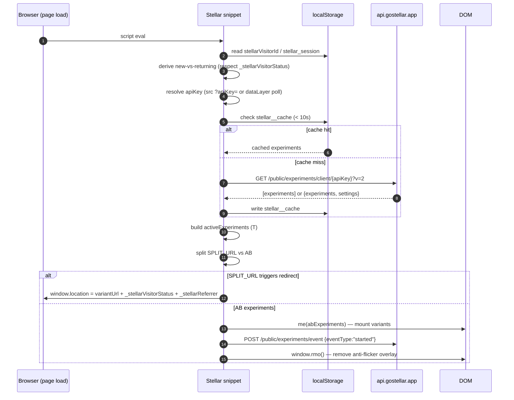
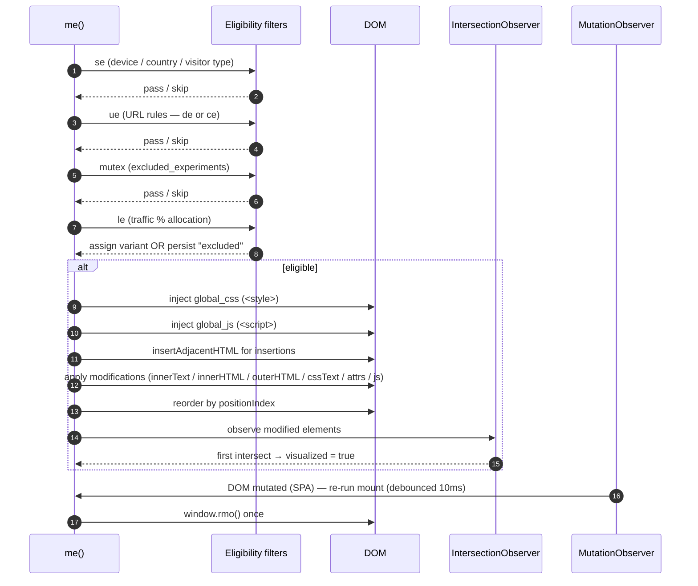
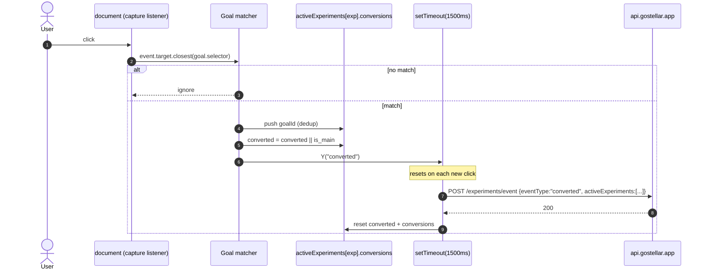
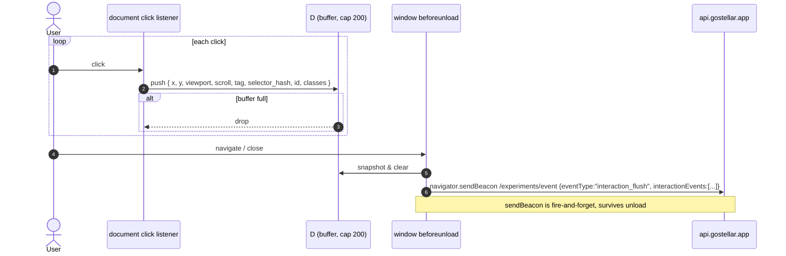
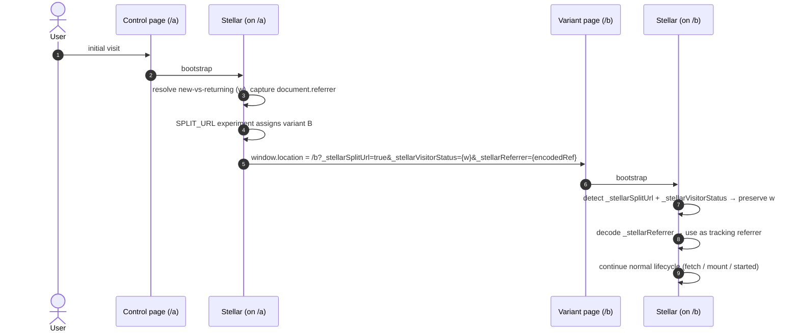
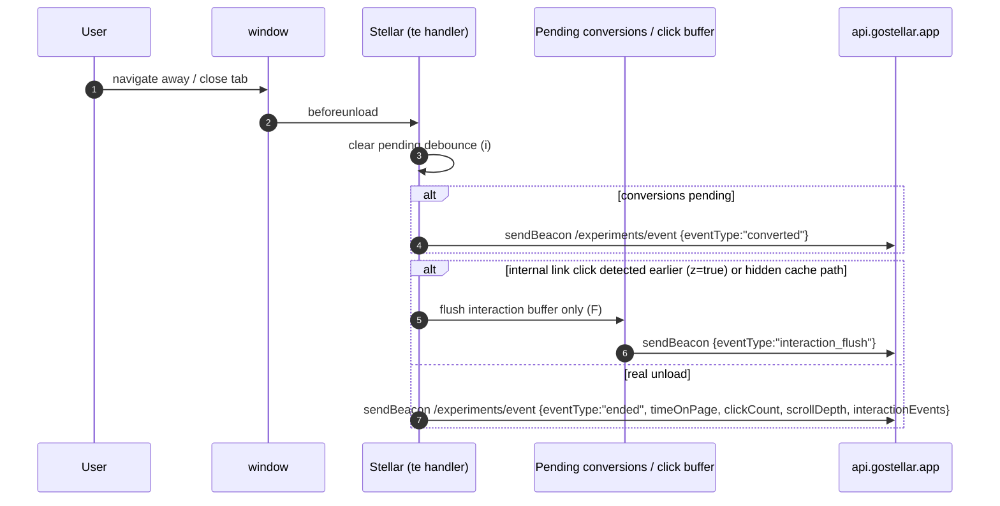

# Stellar A/B Testing Snippet — Reference

The `gostellar.app` client snippet (version `11-11-2025`) is embedded inline in [index.html](index.html) and [index-b.html](index-b.html). This document explains what it does and diagrams the main runtime flows.

Function names below (`ve`, `me`, `pe`, `O`, …) refer to the minified identifiers so you can grep the inlined script.

---

## 1. Overview

A self-contained client-side experimentation runtime. On every page load it:

1. Identifies the visitor and session.
2. Fetches the project's experiments from `api.gostellar.app`.
3. Filters experiments by targeting rules (device, country, URL, visitor type, traffic allocation, mutual exclusion).
4. Applies the assigned variant's DOM/CSS/JS modifications.
5. Tracks clicks, scroll, page visits, and goal conversions.
6. Ships events back via `fetch` with a `sendBeacon` fallback.

It also supports a visual editor mode (`?stellarMode=true`), split-URL redirect experiments, and an anti-flicker pre-render overlay.

---

## 2. Identity & session

| Store | Key | Purpose | TTL |
|---|---|---|---|
| `localStorage` | `stellarVisitorId` | Stable visitor id (`visitor_<ts><rand>`) | Persistent |
| Cookie (if subdomain testing) | `stellarVisitorId` | Same id on `.domain.tld` | 90 days |
| `localStorage` | `stellar_session` | `{ id, lastActivity }` | 30 min inactivity |
| `sessionStorage` | `stellarSessionStarted` | First-hit-this-tab flag | Tab lifetime |
| `sessionStorage` | `stellarIsReturningVisitor` | New vs returning decision | Tab lifetime |
| `localStorage` | `stellarData` | `{ experimentId: variantId \| "excluded" }` | Persistent |
| `localStorage` | `stellar__cache` | Experiment list cache | 10 s |

**New vs returning** (`w`): true if a prior `stellarVisitorId` existed in localStorage or the subdomain cookie. Preserved across **split-URL redirects** via the `_stellarVisitorStatus` query param so a redirect from the control URL to the variant URL doesn't reset the flag. Original `document.referrer` is likewise carried through `_stellarReferrer`.

---

## 3. Config & bootstrap

URL params read from `window.location.search`:

| Param | Effect |
|---|---|
| `stellarDebugging` | Enables `console.log` via internal `v(...)` |
| `stellarLocalMode=true` | Editor script loads from `localhost:3001` |
| `stellarMode=true` | Injects the visual editor script and pings `/snippet-page-ping` |
| `experimentId` | Included in the editor ping |
| `_stellarSplitUrl=true` | Marks this page as a split-URL redirect target |

The API key is read from the snippet's own `<script src="...?apiKey=...">`. If absent, the script polls `window.dataLayer` up to 40× at 50 ms looking for an entry with `stellarApiKey`.

---

## 4. Experiment lifecycle

Entry point: `ve()`.

1. Resolve `apiKey`.
2. Return cached experiments if `stellar__cache` is < 10 s old.
3. Otherwise `GET {API}/public/experiments/client/{apiKey}?v=2` — response is either an array or `{ experiments, settings }` where `settings.alwaysOnTracking` forces `started`/`ended` events even when no experiments match.
4. Build `activeExperiments` (`T`) — one entry per experiment tracking `variant`, `converted`, `conversions[]`, `experimentMounted`, `visualized`, goal metadata.
5. If any experiment's project has `subdomain_testing`, write the visitor id cookie on `.domain.tld`.
6. Split by type:
   - `SPLIT_URL` → redirect logic (stops further processing if this page triggers a redirect).
   - `AB` → `me(abExperiments, …)` to mount.
7. After mount: attach click-heatmap listener (`ee`), beforeunload handler (`te`), delegated conversion listeners (`pe`), and send `started`.

### Eligibility filters (per experiment, inside `me`)

In order, any failing check aborts mount:

- **`se`** — device, country (`navigator.language`!), new/returning visitor type.
- **URL rules** — `de` for legacy experiments (`id < 1550`, simple `contains`/`exact`) or `ce` for the advanced rule engine (`equals`, `contains`, `starts_with`, `ends_with`, `matches_regex`, plus negations and AND/OR combinators, targetable at full URL / `page_path` / `query_params`).
- **Mutual exclusion** — `advanced_settings.excluded_experiments[]`: if the visitor is already assigned to any listed experiment (present in `stellarData`), skip.
- **`le` traffic allocation** — rolls `Math.random() * 100` once, persists `"excluded"` in `stellarData` on miss so future visits stay out.

---

## 5. Variant application

Given an eligible experiment, the assigned variant (`stellarData[id]` or `experiment.variant_to_use`) is applied:

- **`global_css`** → appended as `<style>` to `<head>`.
- **`global_js`** → appended as `<script>` to `<body>`.
- **Insertions** (`type === "creation"` or a modification with `anchorSelector`) → `anchor.insertAdjacentHTML(mode, outerHTML)` where `mode` maps friendly names (`after`, `before`, `prepend`, `append`) to `afterend` / `beforebegin` / `afterbegin` / `beforeend`. Skipped if an element with the same `data-stellar-id` already exists.
- **Modifications** → per selector: `innerText`, `innerHTML`, `outerHTML` (preserves event listeners when the tag is unchanged by only syncing attributes + `innerHTML`), `cssText`, attributes, or custom `js` (called with the element as `element`).
- **Reordering** (`positionIndex`) → moves the element within its parent via `removeChild`+`insertBefore`; annotates with `data-stellar-position`.
- **Template interpolation** — text values run through `o()`, replacing `{{varName||fallback}}` with `window.__stellar.variables[varName]`.
- **IntersectionObserver** — for each modified element, flips the experiment's `visualized = true` on first viewport intersection, then disconnects.
- **MutationObserver** on `document.body` (`{childList:true, subtree:true}`) — re-runs mount for SPA DOM changes. Debounced by 10 ms.
- Missing selectors are appended as deduped entries to `sessionIssues` and sent with the next event (`MODIFICATION` / `INSERTION` types).
- After mount: calls `window.rmo()` to remove the site's anti-flicker overlay.

---

## 6. Conversions & interactions

### Click goals (`pe`)
For each goal where `type === "CLICK"`, a single delegated capture-phase listener is attached to `document`. On click:

1. `event.target.closest(goal.selector)` — no match, ignore.
2. Find the experiment in `T`; only count if it was ever mounted (`a(id)`) or cross-domain mode is on.
3. If `GoalExperiment.is_main`, set `converted = true`.
4. Push goal id into `conversions[]` (deduped per batch).
5. Schedule `O("converted")` on a 1.5 s debounce (`Y`), so multiple rapid clicks ship as one event.

Duplicate setup is guarded by `window.__stellarClickGoalsSetup` (a `Set` of `${expId}-${goalId}`).

### Page-visit goals (`ge`)
Checked against `window.location.href` using the same rule engine on every page load / SPA navigation.

### Click-heatmap buffer (`ee`, `s`, `F`)
Every `document` click pushes a record into `D` (max 200 entries):

```json
{
  "event_name": "element_click",
  "ts": "...",
  "page_url": "...",
  "x": 0.1234,          // clientX / viewportW, 4 dp
  "y": 0.5678,
  "viewport_w": 1440, "viewport_h": 900,
  "scroll_y": 120,
  "element_tag": "BUTTON",
  "selector_hash": "djb2-hash-of-selector",
  "data": "{\"id\":\"...\",\"classes\":[\"btn\",\"btn-primary\"]}"
}
```

Flushed to `/public/experiments/event` as `interaction_flush` — on `beforeunload` via `sendBeacon`, or piggy-backed onto outgoing event payloads (`interactionEvents` field in `O`).

---

## 7. Event delivery (`O`)

Endpoint: `POST https://api.gostellar.app/public/experiments/event`

**Event types:** `started` | `assigned` | `converted` | `ended` | `interaction_flush`.

**Payload (event):**
```json
{
  "visitorId": "...",
  "sessionId": "...",
  "timeOnPage": 0, "clickCount": 0, "scrollDepth": 0,
  "idempotencyKey": "<visitor>_<type>_<ts>",
  "activeExperiments": [ { "experiment": 1, "variant": 2, "converted": false, "conversions": [], "experimentMounted": true, "visualized": true, ... } ],
  "visitedPages": [ ... ],
  "sessionIssues": [ { "type": "MODIFICATION", "message": "Element not found for selector: ..." } ],
  "userAgent": "...",
  "eventType": "started",
  "timestamp": "...",
  "deviceType": "desktop|tablet|mobile",
  "country": "US",
  "apiKey": "...",
  "ga4ClientId": "1234567890.1234567890",
  "interactionEvents": [ ... ],
  "referrer": "...", "isReturning": false,
  "utmCampaign": "...", "utmSource": "...", "utmMedium": "...", "utmTerm": "...", "utmContent": "..."
}
```

**Delivery strategy:**
- Normal path: `fetch` (`Content-Type: application/json`).
- On `fetch` failure OR during page unload: `navigator.sendBeacon(url, body)`.
- `started` is guarded by `X` to fire once per page.
- `ended` is sent in `beforeunload` using sendBeacon directly.
- Before sending `ended`, pending `converted` batches are flushed.

UTMs are parsed from `window.location.search` then persisted in `sessionStorage.stellarTrackingData` so they survive within-site navigation. GA4 `client_id` is parsed from the `_ga` cookie.

---

## 8. Anti-flicker

The host site is expected to define `window.rmo()` that hides a full-page overlay pre-applied during SSR/early `<head>`. The snippet calls it:

- After `me` finishes mounting successfully.
- On fetch error, no api key, or empty experiment list (debug codes 2–5).

This prevents the flash-of-original-content before variants paint.

---

## 9. Sequence diagrams

### 9.1 Bootstrap & experiment fetch



### 9.2 Variant mount & DOM application



### 9.3 Click conversion



### 9.4 Interaction tracking flush



### 9.5 Split-URL redirect with state preservation



### 9.6 Page unload `ended` event



---

## 10. Quick function index

| Function | Role |
|---|---|
| `ve` | Entry point — resolve API key, fetch experiments, kick off mount |
| `me` | Mount AB experiments, set up MutationObserver |
| `ae` | Apply a single modification to an element |
| `re` | Reorder element by `positionIndex` |
| `pe` | Set up delegated click-goal listeners |
| `ge` | Evaluate page-visit goals |
| `se` | Device / country / visitor-type targeting |
| `le` | Traffic-allocation roll (sticky via `stellarData`) |
| `de` / `ce` | URL rule engine (legacy vs advanced) |
| `ue` | Chooses between `de` and `ce` |
| `O` | Send event (fetch → sendBeacon fallback) |
| `F` | Flush interaction buffer |
| `ee` | Attach click-heatmap listener |
| `te` | `beforeunload` handler |
| `Y` | Debounced event dispatch (1500 ms) |
| `H`/`N` | Resolve visitor id (localStorage → cookie → generate) |
| `E`/`R` | Read/write `stellarData` (localStorage + optional cookie) |
| `oe` | Device type detection |
| `o` | `{{var||fallback}}` template interpolation |
| `b` | Remove anti-flicker overlay (`window.rmo()`) |
